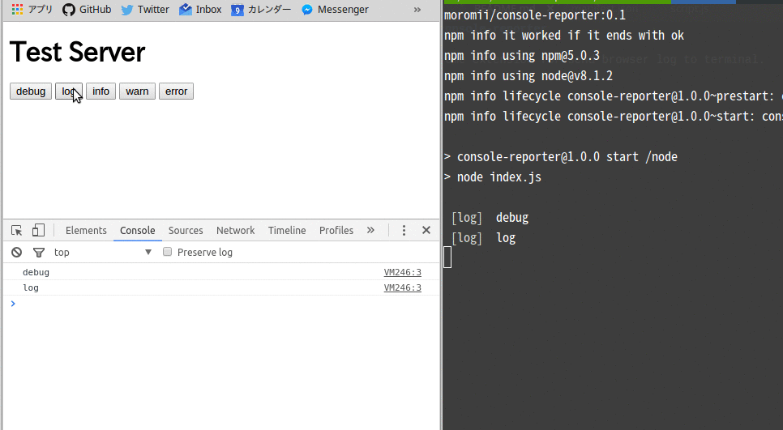

# console-reporter

Chrome extension for send browser log to terminal.



## How To Use

Download chrome extension [here!](https://chrome.google.com/webstore/detail/console-reporter/mnojelhkkdbklbncbemblmpbnkpncpfe)

Run docker container that receive browser log.

```
$ docker run -p 3333:3333 moromii/console-reporter:0.1
```

chrome extension send log only in `localhost` or `0.0.0.0`.
